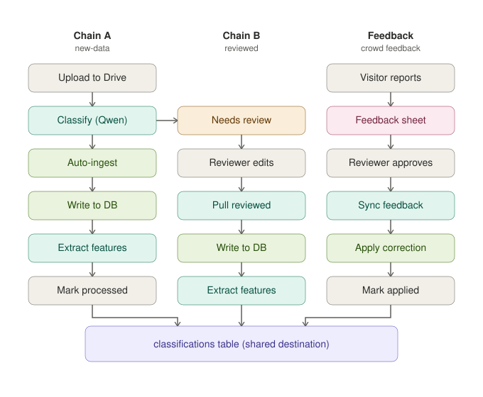

# How data flows through this platform

This document explains, in plain language, how a paper's classification ends up in the
database — and where a human is involved along the way. There are **three separate
chains**. They don't run on the same schedule, and none of them waits for the others.

For the technical detail behind each script, see `architecture.md` and `handover.md`.
This page is the map, not the manual.

**How to read the colors:** gray boxes are a person doing something (uploading a file,
editing a sheet, clicking approve). Teal boxes are a script running on its own. Green
boxes are the moment something actually gets written to the database. Amber means
"waiting on a person." Pink is where outside input comes in. Purple is the shared table
all three chains eventually feed into.

The one arrow that crosses between columns — from Chain A's **Classify (Qwen)** box over
to Chain B's **Needs review** box — is the actual handoff. Everything else in each chain
runs on its own, without waiting for the other two.

---

## Chain A — new papers coming in

**What starts it:** someone uploads a new Web of Science export file to a shared Google
Drive folder. That's the only trigger — nothing else needs to happen first.

**What happens automatically:** the pipeline notices the new file, downloads it, and asks
an AI model (Qwen) to read each paper and decide which of the 22 ecosystem services it
relates to, and how confident the model is in that answer.

**Where a person comes in:** only for the papers the model *isn't* sure about. If the
model is confident, the paper goes straight into the database with no human involved. If
it's not confident, the paper is set aside and handed off to Chain B instead — a person
has to look at it before it counts.

**Where it ends up:** confident papers land in the database right away, then get a second
pass that pulls out extra details (which country, which institution, which technology
category). The original uploaded file is then moved to a "processed" folder so it doesn't
get picked up again.

**Scripts involved:** `classify.py` (the AI classification step), `ingest_incremental.py`
(writes to the database), `text_analysis.py` (the extra details pass), all coordinated by
`run_pipeline.py new-data`.

---

## Chain B — the papers a person had to check

**What starts it:** this chain has no trigger of its own — it only exists to catch up on
whatever Chain A set aside. It's meant to be run regularly (say, once a day), whether or
not there's anything waiting.

**What happens automatically:** the pipeline checks whether a person has finished
reviewing any of the papers sitting in the review spreadsheet.

**Where a person comes in:** this whole chain *is* the human step. Someone opens the
review spreadsheet, reads the paper's title and the AI's guess, and either confirms the
guess or corrects it. They can correct just one field (say, the ecosystem service) and
leave everything else as the AI suggested.

**Where it ends up:** once a person marks a row as done, it gets pulled back in, written
to the database with their corrections applied, and — same as Chain A — gets the extra
detail pass run on it too.

**Scripts involved:** `classify.py --pull-reviewed`, `ingest_incremental.py`,
`text_analysis.py`, coordinated by `run_pipeline.py reviewed`.

---

## Feedback — when someone spots a mistake after the fact

**What starts it:** anyone browsing the public Data Explorer can flag a paper they think
is misclassified. They look it up, suggest what they think the correct classification
should be, and explain why. This is the only chain that starts from *outside* the team.

**What happens automatically:** their suggestion gets logged to a separate spreadsheet,
completely separate from the one Chain B uses.

**Where a person comes in:** twice. First, someone on the team reads the suggestion and
decides whether to approve it, reject it, or ask for more information — nothing happens
until it's explicitly approved. Second, once it's approved, the correction is applied and
the sheet is updated automatically so the reviewer can see it actually took effect,
without needing to check the database themselves.

**Where it ends up:** the paper's classification is corrected directly in the database.
This is completely separate from the narrative page's published numbers, which are frozen
at their original values and never change no matter how many corrections get applied here
— see `architecture.md` for why that separation exists.

**Scripts involved:** `sync_feedback.py`, coordinated by `run_pipeline.py feedback`.

---

## The one thing all three have in common

None of these three chains waits for either of the other two. Chain A can be mid-upload
while Chain B is picking up yesterday's reviews while a visitor is flagging a paper on the
Explorer — they don't block each other, and a delay in one doesn't stall the others. The
only thing they share is where they end up: the same `classifications` table.
