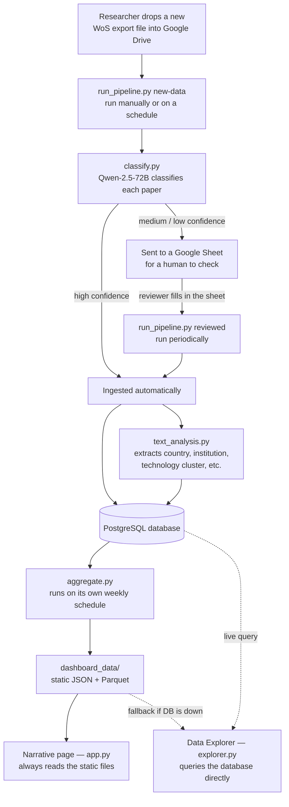
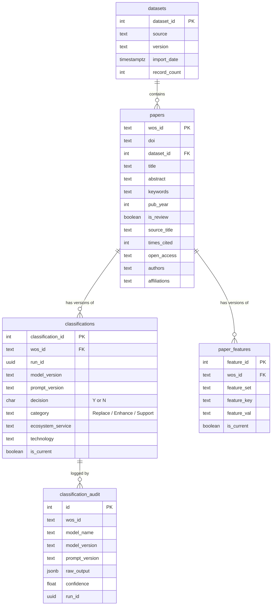

# Architecture Overview

*Last updated: August 2026*

This document explains how the MEco Research Data Platform is put together — what each piece does, why it's built this way, and how data moves from a raw Web of Science export to a number on the dashboard.

If you're picking this project up for the first time, read this document first, then `data_dictionary.md` (what the data means), then `handover.md` (how to actually operate it).

---

## 1. The idea

The dashboard you see is the small, visible part. The real asset is the database underneath it — a growing, structured collection of bio-inspired research papers that the lab can keep building on.

Three things were kept independent on purpose, so any one of them can change later without breaking the others:

- **Where the data comes from.** Right now it's Web of Science exports. If the lab wants to add Scopus or another source later, that's a new ingestion script — it doesn't touch the database design.
- **Which AI model does the classification.** Models and prompts will change over time. Every classification result is tagged with the model version and prompt version that produced it, so switching models never destroys history.
- **How the dashboard looks.** Streamlit works well today. Because the dashboard reads from a normal database and a handful of JSON/Parquet files (not something Streamlit-specific), a future team could swap in a different front end without rebuilding the pipeline.

---

## 2. System overview



A few things worth noticing in this diagram before you read further:

- **There is no GitHub Actions, no CI/CD pipeline.** Everything — classification, database writes, feature extraction — runs on the same cloud server (EC2) that hosts PostgreSQL. This was in an earlier plan but wasn't built that way; the reasoning is in [Section 6](#6-where-computation-happens).
- **Two separate things trigger ingestion**, not one: a new file appearing on Drive, and a human finishing a review in a Google Sheet. These run as two separate commands, not one linear pipeline. See [Section 4](#4-the-day-to-day-workflow).
- **The narrative page and the Explorer intentionally show different data.** The narrative page's numbers are frozen at the original published corpus. The Explorer always shows everything currently in the database. This is explained in [Section 3](#3-key-design-decisions).

---

## 3. Key design decisions

These are the choices that shape everything else in the codebase. If something in the code looks unusual, it's probably because of one of these.

### 3.1 Facts vs. derived features (two-layer schema)

The `papers` table only holds raw facts that don't need interpretation: title, year, citation count, journal. Anything that comes from an NLP process — extracted country, institution, technology cluster — lives in a separate `paper_features` table.

Why split them up: NLP methods get better over time. If country extraction improves next year, you re-run that one extraction step and it only touches `paper_features`. The underlying facts in `papers` are never at risk of being accidentally changed by a feature-extraction bug.

### 3.2 Confidence-based routing, not full automation

The original plan assumed every paper could be classified automatically with no human involved. In practice, the LLM (Qwen-2.5-72B) reports its own confidence — high, medium, or low — for every classification, and that number isn't reliable enough to ignore for medium/low cases.

So the pipeline splits on it:

- **High confidence** → written to the database automatically, no human involved.
- **Medium or low confidence, or a failed API call** → pushed to a Google Sheet. A person reviews it, fills in a correction if needed, and only then does it get written to the database.

This means the pipeline can't be "one command that always finishes everything" — see 3.4.

### 3.3 The narrative page is frozen; the Explorer is live

This is the biggest difference from the original May plan, which assumed the narrative page would always show "the absolute latest" numbers. That turned out to be the wrong choice.

The narrative page tells a specific story built around a specific, cited set of numbers (68,917 papers, 31,559 in the target corpus, etc.). If those numbers silently changed every time someone added new papers, the narrative would contradict itself over time, and any citation of "31,559 papers" in a publication would go stale.

So the two dashboard pages behave differently on purpose:

| | Narrative page (`app.py`) | Data Explorer (`explorer.py`) |
|---|---|---|
| Data source | Static JSON files in `dashboard_data/` | Direct database query |
| What it shows | The original published corpus only (`dataset_id = 1`) | Everything currently in the database |
| Updates when | Only when `aggregate.py` is deliberately re-run and the output files are redeployed | Every 15 minutes automatically (or on demand via a refresh button) |

This is enforced in `aggregate.py` with a `LEGACY_DATASET_IDS` constant — every query that feeds the narrative page filters to that dataset. The Explorer's query has no such filter.

### 3.4 Two decoupled pipeline chains, not one

Because of 3.2, `run_pipeline.py` can't wait for a human to finish reviewing before it "completes." So it's split into two independent commands:

- **`new-data`** — checks Google Drive for new files, classifies them, and ingests only the high-confidence rows. Run this whenever new files show up (manually, or on a schedule).
- **`reviewed`** — checks the Google Sheet for rows a human has finished reviewing, and ingests those. Run this on its own schedule (e.g. daily), independent of whether new files have arrived.

`aggregate.py` (which regenerates the narrative JSON and the Explorer's fallback files) is decoupled from both — run it on its own weekly schedule. Its output doesn't need to be fresher than that; the narrative is frozen anyway, and the Explorer already queries the database live.

### 3.5 A local archive solves a metadata problem

When a paper's row gets sent for human review (3.2), its full metadata (title, abstract, authors, etc.) isn't written to the database yet — only the classification result eventually will be, once reviewed. But by the time a human finishes reviewing it days later, the original uploaded file has already been moved to a "processed" folder on Drive.

To avoid having to hunt through Drive for which file a given paper came from, `run_pipeline.py` keeps a permanent local copy of every file it ever downloads, in `data/wos_archive/`. When it's time to ingest reviewed rows, it just reads everything in that folder.

---

## 4. The day-to-day workflow

For the person maintaining this day to day (not necessarily an engineer), here's what actually happens:

1. **Drop a file.** Export new papers from Web of Science, drop the raw file into the shared Google Drive folder. Nothing else needed at this step.
2. **Run the new-data check.** Someone (or a cron job) runs `python run_pipeline.py new-data` on the server. It finds the new file, classifies every paper in it, and automatically saves the ones the model is confident about. Anything it's unsure about goes to a review spreadsheet.
3. **Review the uncertain ones.** A person opens the Google Sheet, checks the flagged papers, and fills in a correction (or confirms the model was right).
4. **Run the reviewed check.** Periodically (daily is reasonable), someone runs `python run_pipeline.py reviewed`. It picks up whatever's been finished in the sheet and saves it to the database.
5. **Weekly refresh.** Once a week, `python run_pipeline.py aggregate` regenerates the narrative page's files and the Explorer's backup snapshot.

The Explorer itself needs no manual step — it queries the database directly and refreshes every 15 minutes on its own.

---

## 5. Database design



What each table is for, in plain terms:

- **`datasets`** — one row per import batch. Tells you where a group of papers came from and when. `dataset_id = 1` is the original historical import — the narrative page is locked to this one.
- **`papers`** — one row per paper, raw facts only. Primary key is `wos_id`, not DOI, because about 4% of papers don't have a DOI.
- **`classifications`** — the LLM's decision for each paper. Versioned: when a paper gets reclassified (e.g. after a model upgrade), the old row is marked `is_current = FALSE` instead of being deleted, and a new row is inserted. A unique index guarantees only one `is_current = TRUE` row exists per paper at a time.
- **`paper_features`** — NLP-derived attributes (country, institution, technology cluster, etc.), same versioning pattern as `classifications`. `feature_set` groups features by which extraction method produced them (e.g. `'nlp_v1'`); `feature_key`/`feature_val` is a flexible key-value pair so new feature types don't need a schema change.
- **`classification_audit`** — one row per LLM API call, storing exactly what the model said (`raw_output` as JSONB) and how confident it was. This is what makes a classification defensible later: if someone questions a result, you can look up exactly what the model saw and said. Note: this table does **not** store who reviewed a paper or when — that information lives only in the Google review sheet (see `handover.md`).
- **`pipeline_runs`** — one row per pipeline run (both the individual scripts and `run_pipeline.py`'s own summary rows), so a maintainer can see what ran, when, and how many papers were touched.

---

## 6. Where computation happens

Everything runs on one EC2 server: the database, the LLM classification calls, feature extraction, and the aggregation step. There is no separate CI/CD system doing any of this.

An earlier plan considered splitting the work — heavy computation on the server, lightweight orchestration (detecting new files, triggering the pipeline) on GitHub Actions. That was never built. Running everything on the same server that already hosts the database is simpler to reason about and avoids the timeout/rate-limit problems that come with running long LLM calls inside a CI system.

---

## 7. Incremental processing

Old papers are only reprocessed if there's a deliberate reason to (e.g. a model upgrade). A normal run only touches genuinely new `wos_id`s — the "what's new" check is a straightforward query: does this `wos_id` already have an `is_current = TRUE` row?

A few specifics worth knowing:

- If a pipeline run crashes partway through, the next run picks up wherever it left off — no special recovery logic needed, because "already processed" is just a database fact, not a saved state file.
- New batches get their own `dataset_id`. The original historical import is `dataset_id = 1`; every incremental batch after that gets a new one. This is what lets the narrative page filter to just the original data (Section 3.3).
- `text_analysis.py`'s four feature-extraction tasks (WoS categories, countries, institutions, funding) re-run over the **whole** corpus every time, not just new papers — the corpus is small enough (tens of thousands of rows) that this is cheap. The technology-cluster assignment is the one exception: it only assigns papers that don't already have a cluster, to avoid disturbing the original human-curated cluster labels. See `data_dictionary.md` for why.

---

## 8. Pipeline outputs & data interfaces

`aggregate.py` is the bridge between the database and the dashboard. It writes everything to `dashboard_data/`:

**For the narrative page** (all filtered to the original corpus only — see 3.3):
- `corpus_meta.json` — top-level funnel numbers (total papers, non-review, decision=Y count).
- `services_summary.json` — the 22 ecosystem services broken down by Replace/Enhance/Support.
- `annual_by_category.json`, `country_oa.json`, `support_spotlight.json`, `wos_cooccurrence.json`, `framing.json` — the data behind each narrative chart.
- `discovery_data/` — intermediate files used to manually decide chart groupings and word choices (e.g. which WoS categories cluster together, which words to feature in the framing chart). These aren't read by the dashboard directly; they're reference material for whoever curates those charts next.

**For the Data Explorer:**
- `papers_classified.parquet` and `abstracts.parquet` — used only as a fallback if the database is unreachable. Under normal conditions, the Explorer queries PostgreSQL directly (unfiltered — it always shows the full current corpus) and refreshes every 15 minutes. This was a "long-term target" in the original May plan; it's now the current, working behavior.

---

## 9. Codebase layout

```
repo/
├── app.py                        # Narrative page (Streamlit entry point)
├── pages/
│   └── explorer.py               # Data Explorer
├── pipeline/
│   ├── ingest_initial.py         # One-time historical load — disaster recovery only,
│   │                              # not part of routine operation
│   ├── ingest_incremental.py     # Writes new/reviewed papers into PostgreSQL
│   ├── classify.py               # LLM classification with confidence routing
│   ├── text_analysis.py          # NLP feature extraction → paper_features
│   ├── aggregate.py              # Database → dashboard_data/ (weekly)
│   └── run_pipeline.py           # Orchestrates new-data / reviewed / aggregate
├── dashboard_data/                # Pre-computed JSON & Parquet, checked into git
│   └── discovery_data/            # Reference material, not read by the dashboard
├── llm_validation/                # Model-selection notebooks (Task 0) — historical
│                                  # reference only, not part of the running system
├── .streamlit/
│   └── config.toml
├── .env.example
├── .gitignore
├── schema.sql                      # ← NEW — one-time DB bootstrap (tested against a real Postgres 16 instance)
├── requirements.txt                 # Dashboard only, lightweight
├── requirements_pipeline.txt        # Pipeline + LLM + embedding libraries
└── docs/
    ├── README.md                    # Start here
    ├── architecture.md              
    ├── data_dictionary.md           
    ├── data_schema_supplement.md    
    ├── prompt_specification.md     
    ├── environment_setup.md         # ← NEW — one-time setup (AWS, server, DB, OpenRouter, Google Cloud)
    └── handover.md                  # Day-to-day operation, troubleshooting, Google Sheets/Drive design notes
```
